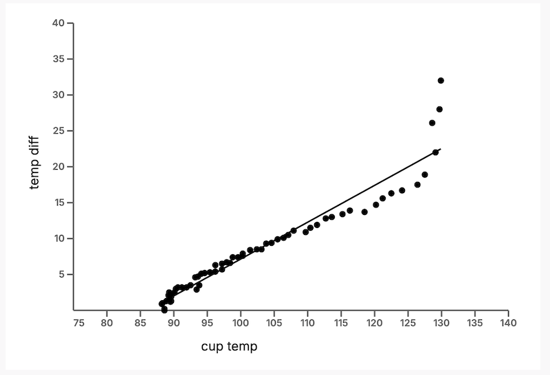

# Smart Coaster

## Overview
The Smart Coaster is an interactive device designed to enhance the drinking experience by monitoring beverage temperatures and providing real-time feedback. It helps users track the cooling process of their drinks, log data for caffeine intake and drinking habits, and customize settings for a more personalized experience. By integrating hardware and software components, this project offers a solution to the common problem of forgotten, cold coffee or tea.
- **Hardware:** Infrared temperature sensor, Heltec ESP32 microcontroller, WS2812B Addressable RGB LED lights.
- **Software:** Arduino-based firmware, a BLE-enabled web dashboard, and data visualization tools.

---

## Features
- **Real-Time Temperature Monitoring:** Reads the temperature every 500ms and updates LED lights to reflect the drink's status.
- **Customizable User Settings:** Allows users to set temperature thresholds, drink type, and mug size 
- **Data Logging:** Tracks caffeine intake, cooling time, and drink completion for the past 7 days. 
- **Interactive Dashboard:** Displays real-time and historical temperature data using Chart.js.

---

## Technical Details

### Hardware
1. **Infrared temperature sensor (MLX90614):** Measures the temperature at the base of the mug.
2. **Heltec ESP32:** Handles data processing and communication via BLE.
3. **WS2812B addressable RGB LED Lights:** Indicate temperature status with customizable thresholds for color changes.
4. **3D-Printed Coaster:** Designed using OnShape.
5. **3.7V 3000mAh LiPo Battery:** Powers the ESP32.

### Software
1. **Arduino Firmware:** Manages sensor readings, BLE communication, and LED updates.

    **Libraries:**  
    - **Adafruit MLX90614** for temperature readings.  
    - **BLE Device** for communication with the web client.  
    - **FastLED** for LED control.
2. **Web Dashboard:** Built with HTML, JavaScript, and Chart.js to visualize real-time and historical data.
3. **Temperature Calibration:** Implements a linear regression model to adjust sensor readings for accurate liquid temperature representation.

**Data Model**  
```
{
    "Size": string,
    "Type": string,
    "CaffeineAmount": int(mg),
    "InitialTemp": float,
    "CoolingTime": int(seconds),
    "InitialReadTime": string,
    "FinishedTime": string
}
```
This model stores drink-specific details for analysis and user convenience.

---

## Key Functionalities
- **Visual Temperature Feedback:** Alerts users whether their drink is at their preferred temperature for consumption through LED color changes.
- **Caffeine and Drink History Visualization:** Provides users with insights into their drinking habits. 

---

## Visuals
- **3D Model of the Coaster**:  
  - CAD render of the coaster design.

    
    

    

- **Hardware Assembly**:  
  - The following images showcase the hardware components of the Smart Coaster. The first image shows the fully assembled coaster, while the second provides a look inside, revealing the infrared temperature sensor, WS2812B RGB LEDs, Heltec ESP32 board, and the LiPo battery.
    

    

- **Web Dashboard**:  
  - Real-time temperature graph, historical data visualization, and user settings page.
  
     

     

- **Light Cycle**:
  - Demonstrating the coaster’s LED color changes in sync with temperature readings.

     
    
    

    
    
    

    
    
    

- **Linear Regression Analysis**:
  - This graph demonstrates the linear regression analysis conducted to improve the accuracy of the temperature readings. By analyzing the difference between the sensor's readings at the bottom of the mug and the actual liquid temperature over time, adjustments were made to more accurately display the real-time temperature of the liquid.

    
